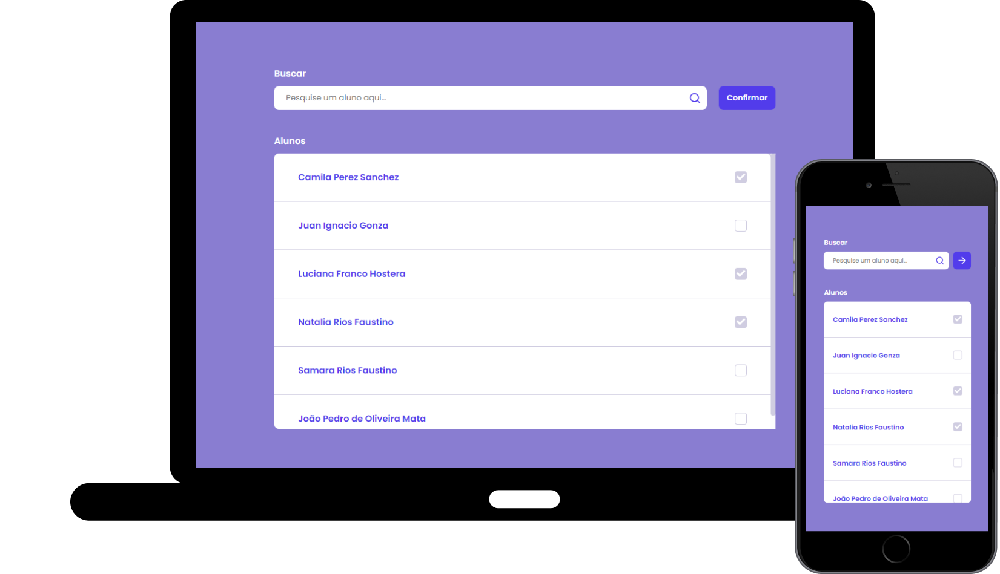

<h1 align="center">
    Exam eduCAT
<h1>

<h1 align="center">ReactJS || Node.js
    
  
        
        
    

</h1>

  <a href="#❓-sobre">Sobre</a>&nbsp;&nbsp;&nbsp;|&nbsp;&nbsp;&nbsp;
   <a href="#🚧-implementação">Implementação</a>&nbsp;&nbsp;&nbsp;|&nbsp;&nbsp;&nbsp;
  <a href="#💻-tecnologias">Tecnologias</a>&nbsp;&nbsp;&nbsp;|&nbsp;&nbsp;&nbsp;
  <a href="#🔥-como-executar">Como Executar</a>&nbsp;&nbsp;&nbsp;

    <a align="center">https://educat.vercel.app/<a>

## ❓ Sobre

### O **Exam eduCAT** é uma aplicação feita para facilitar o processo de chamada nas salas de aula. A aplicação oferece a possibilidade de registrar a presença dos alunos de acordo com a aula que o professor está ministrando. 

## 🚧 Implementação

#### Para criação da aplicação foi desenvolvido um layout simples e objetivo com poucas funcionalidades, trazendo somente o necessário para o uso.
#### Foi escolhido o Whimsical para a construção do Wireframe da aplicação e o Figma para desenvolvimento do template. 

<a href="https://whimsical.com/XRd5QgcvCfveJxdreepgfX">Whimsical</a>&nbsp;&nbsp;&nbsp;|&nbsp;&nbsp;
<a href="https://www.figma.com/file/MIhugLlxZMyGDehx4460o1/Untitled?node-id=41%3A169">Figma</a>

#### Para desenvolvimento do banco de dados foi pensado na necessidade de relacionar os professores às matérias e os estudantes às matérias também, criando duas relações muito para muito. Para uma pré visualização da construção da API, foi construído o diagrama utilizado o drawSQL. 
#### Visando a praticidade, o banco de dados foi feito em SQLite e já populado com alguns dados por padrão.

<a href="https://drawsql.app/telemont/diagrams/educat">drawSQL</a>

    
#### No desenvolvimento da API foi pensado no que há de mais atual no mundo do backend. Com isso a API é feita no modelo API REST e pode ser consumida com maior facilidade pelos clientes.

## 💻 Tecnologias 
-  [JavaScript](https://www.javascript.com/)
-  [Node.js](https://nodejs.org/en/)
-  [ReactJS](https://reactjs.org/)
-  [Express](https://expressjs.com/)
-  [Sequelize](https://sequelize.org)
-  [Jest](https://jestjs.io/)
-  [Axios](https://github.com/axios/axios)

## 🔥 Como Executar

- ### **Pré-requisitos**

  - É **necessário** possuir o **[Node.js](https://nodejs.org/en/)** instalado no computador
  - É **necessário** possuir o **[Git](https://git-scm.com/)** instalado e configurado no computador
  - Também, é **preciso** ter um gerenciador de pacotes seja o **[NPM](https://www.npmjs.com/)** ou **[Yarn](https://yarnpkg.com/)**.

#### Para executar o servidor da aplicação, abra o terminal do seu sistema operacional, navegue até a pasta do projeto, entre no diretório server e execute:

    npm install

#### Esse comando fará com que o node instale todas as dependências de seu projeto.

#### Para rodar o servidor digite:

    npm start

#### Para executar o frontend, vá até o diretório raiz do projeto e navegue até a pasta web. Dentro do diretório execute:

    npm install

#### Para iniciar o serviço digite:

    npm start

Pronto!!! Agora seu sistema estará rodando na porta 3000 do seu computador.